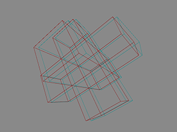
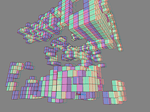
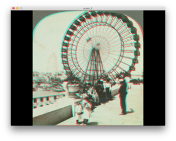

Scam (Stereo Camera)
====================

A few boilerplate examples to get started with anaglyph stero-pair rendering in Processing.

1. Example to combine existing stereoscopic pictures  
  

2. Stereo camera example  
  

3. Stereo camera example with common renderer  
  

4. Scene example

Anaglyph (etymology)
--------------------

From Ancient Greek ἀναγλυφή (anagluphḗ, “work in low relief”); from ana (up) + glyphein (to carve out)

Noun
Anaglyph (plural anaglyphs)

1. A decorative ornament worked in low relief or bas relief, such as a piece of cameo jewelry.

2. A matched pair of images designed to produce a three-dimensional effect when viewed using spectacles that have usually one red and one bluish-green lens, corresponding to the colors of the pairs of images.

Resources
---------

The examples shown here are a mere assemblage of work done by others:

* [http://paulbourke.net/stereographics/stereorender](http://paulbourke.net/stereographics/stereorender) 
  Calculating Stereo Pairs

* [http://www.3dtv.at/knowhow/anaglyphcomparison_en.aspx](http://www.3dtv.at/knowhow/anaglyphcomparison_en.aspx) 
  Anaglyph Methods Comparison

* [https://vimeo.com/62505109](https://vimeo.com/62505109) 
  A Processing example with more resources in the comment area
